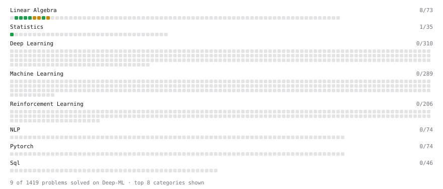

# Deep-ML

My machine learning practice from [Deep-ML](https://www.deep-ml.com). Every solution here was written by hand.

**23** solved · 23 problems · 0 labs · 0 math

[**Browse the interactive portfolio**](https://DebanganMandal.github.io/deep-ml/) to replay this filling in over time.

## Problems

| | Difficulty | Solved | |
| --- | --- | --- | --- |
| [Calculate 2x2 Matrix Inverse](https://www.deep-ml.com/problems/8) | easy | 2026-09-18 | [solution](problems/0008-calculate-2x2-matrix-inverse) |
| [Calculate Cosine Similarity Between Vectors](https://www.deep-ml.com/problems/76) | easy | 2026-09-25 | [solution](problems/0076-calculate-cosine-similarity-between-vectors) |
| [Calculate Covariance Matrix](https://www.deep-ml.com/problems/10) | easy | 2026-09-19 | [solution](problems/0010-calculate-covariance-matrix) |
| [Calculate Mean by Row or Column](https://www.deep-ml.com/problems/4) | easy | 2026-09-18 | [solution](problems/0004-calculate-mean-by-row-or-column) |
| [Convert Vector to Diagonal Matrix](https://www.deep-ml.com/problems/35) | easy | 2026-09-22 | [solution](problems/0035-convert-vector-to-diagonal-matrix) |
| [Dot Product Calculator](https://www.deep-ml.com/problems/83) | easy | 2026-09-25 | [solution](problems/0083-dot-product-calculator) |
| [Phi Transformation for Polynomial Features](https://www.deep-ml.com/problems/84) | easy | 2026-09-26 | [solution](problems/0084-phi-transformation-for-polynomial-features) |
| [Reshape Matrix](https://www.deep-ml.com/problems/3) | easy | 2026-09-18 | [solution](problems/0003-reshape-matrix) |
| [Scalar Multiplication of a Matrix](https://www.deep-ml.com/problems/5) | easy | 2026-09-18 | [solution](problems/0005-scalar-multiplication-of-a-matrix) |
| [Transformation Matrix from Basis B to C](https://www.deep-ml.com/problems/27) | easy | 2026-09-19 | [solution](problems/0027-transformation-matrix-from-basis-b-to-c) |
| [Transpose of a Matrix](https://www.deep-ml.com/problems/2) | easy | 2026-09-18 | [solution](problems/0002-transpose-of-a-matrix) |
| [2D Translation Matrix Implementation](https://www.deep-ml.com/problems/55) | medium | 2026-09-25 | [solution](problems/0055-2d-translation-matrix-implementation) |
| [Calculate Correlation Matrix](https://www.deep-ml.com/problems/37) | medium | 2026-09-19 | [solution](problems/0037-calculate-correlation-matrix) |
| [Calculate Eigenvalues of a Matrix](https://www.deep-ml.com/problems/6) | medium | 2026-09-18 | [solution](problems/0006-calculate-eigenvalues-of-a-matrix) |
| [Gauss-Seidel Method for Solving Linear Systems](https://www.deep-ml.com/problems/57) | medium | 2026-09-26 | [solution](problems/0057-gauss-seidel-method-for-solving-linear-systems) |
| [Gaussian Elimination for Solving Linear Systems](https://www.deep-ml.com/problems/58) | medium | 2026-09-26 | [solution](problems/0058-gaussian-elimination-for-solving-linear-systems) |
| [Implement Reduced Row Echelon Form (RREF) Function](https://www.deep-ml.com/problems/48) | medium | 2026-09-25 | [solution](problems/0048-implement-reduced-row-echelon-form-rref-function) |
| [Matrix times Matrix ](https://www.deep-ml.com/problems/9) | medium | 2026-09-18 | [solution](problems/0009-matrix-times-matrix) |
| [Matrix Transformation ](https://www.deep-ml.com/problems/7) | medium | 2026-09-18 | [solution](problems/0007-matrix-transformation) |
| [Solve Linear Equations using Jacobi Method](https://www.deep-ml.com/problems/11) | medium | 2026-09-19 | [solution](problems/0011-solve-linear-equations-using-jacobi-method) |
| [Determinant of a 4x4 Matrix using Laplace's Expansion (hard)](https://www.deep-ml.com/problems/13) | hard | 2026-09-24 | [solution](problems/0013-determinant-of-a-4x4-matrix-using-laplace-s-expansion-hard) |
| [Singular Value Decomposition (SVD) of 2x2 Matrix](https://www.deep-ml.com/problems/12) | hard | 2026-09-20 | [solution](problems/0012-singular-value-decomposition-svd-of-2x2-matrix) |
| [SVD of a 2x2 Matrix](https://www.deep-ml.com/problems/28) | hard | 2026-09-24 | [solution](problems/0028-svd-of-a-2x2-matrix) |

---

_This file is regenerated by Deep-ML on every push._
